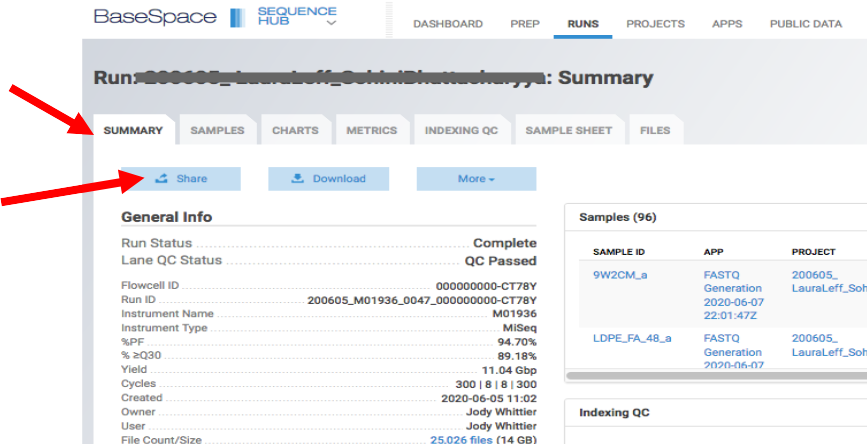

.. module:: basespace-share
   :synopsis: Download data from BaseSpace
.. moduleauthor:: Wirat Pipatpongpinyo<pipatpongpinyo.1@osu.edu>

.. highlight:: rest

|

.. figure:: _static/Logo.png
   :align: right

Share runs and projects in BaseSpace
************************************

|

.. Note::

	:Purpose: These two short tutorials will show you how to share sequencing runs and projects, respectively, on Illumina BaseSpace.
	:Author: `Wirat Pipatpongpinyo <mailto:pipatpongpinyo.1@osu.edu>`_
	:Date: July 6, 2020

.. contents:: :local:

|

Sharing runs
------------

.. figure:: _static/basespace-share_1.png
   :align: right
   :width: 250px

|
|
|
|

**1.** Go to the `Illumina BaseSpace website <`http://basespace.illumina.com>`_ and sign in.

|

|
|
|
|
|
|
|
|
|

**2.** Click on the ``RUNS`` tab.

|
|

.. figure:: _static/basespace-share_3.png
   :align: right
   :width: 450px

|
|
|

| **3.** Select the name of the run
| you want to share.

|

|
| **4.** Go to the ``SUMMARY``
| tab.
|
|
| **5.** Click the ``SHARE``
| button.

.. figure:: _static/basespace-share_5.png
   :align: right
   :width: 380px

|
|
|
|

| **6.** Enter the email address (linked to a
| BaseSpace account) of your
| collaborator.
|
| **6.** Click ``Add Collaborator``.
| (Repeat Steps 6 and 7 if you want to
| share with multiple collaborators.)
|
|
| **8.** Click ``Save Settings``. Your
| collaborator will receive an email from
| `basespace-noreply@illumina.com`.

|
|
|

Sharing projects
----------------

.. figure:: _static/basespace-share_1.png
   :align: right
   :width: 250px

|
|

**1.** Got to the `Illumina BaseSpace website <`http://basespace.illumina.com>`_ and sign in.

|
|
|
|
|
|
|

|
| **2.** Click on the ``PROJECTS`` tab.
|
|
| **3.** Select the Project that you
| would like to share.

|
|

|

**4.** Click the ``Share Project`` button.

|
|

.. figure:: _static/basespace-share_5.png
   :align: right
   :width: 380px

|

| **5.** Enter the email address (linked to a
| BaseSpace account) of your
| collaborator.
|
| **6.** Click ``Add Collaborator``.
| (Repeat Steps 6 and 7 if you want to
| share with multiple collaborators.)
|
|
| **7.** Click ``Save Settings``. Your
| collaborator will receive an email from
| `basespace-noreply@illumina.com`.

|
|
